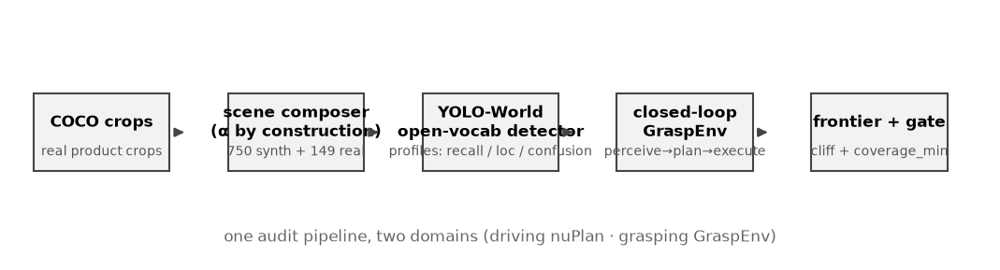
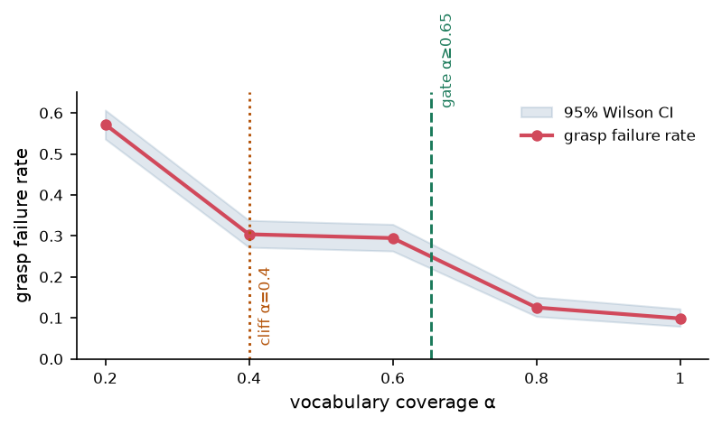
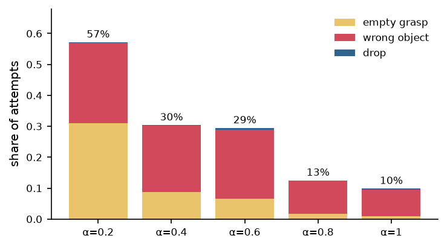
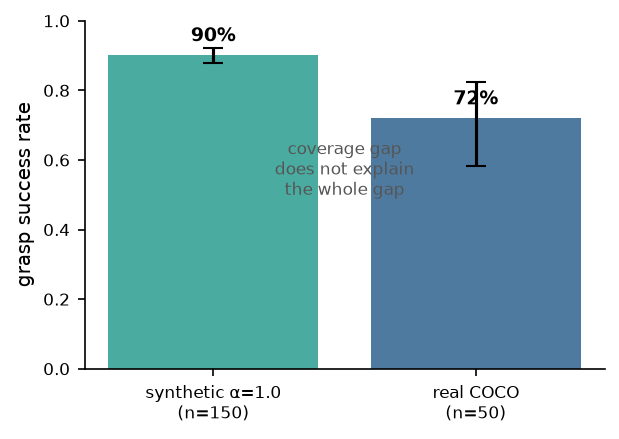
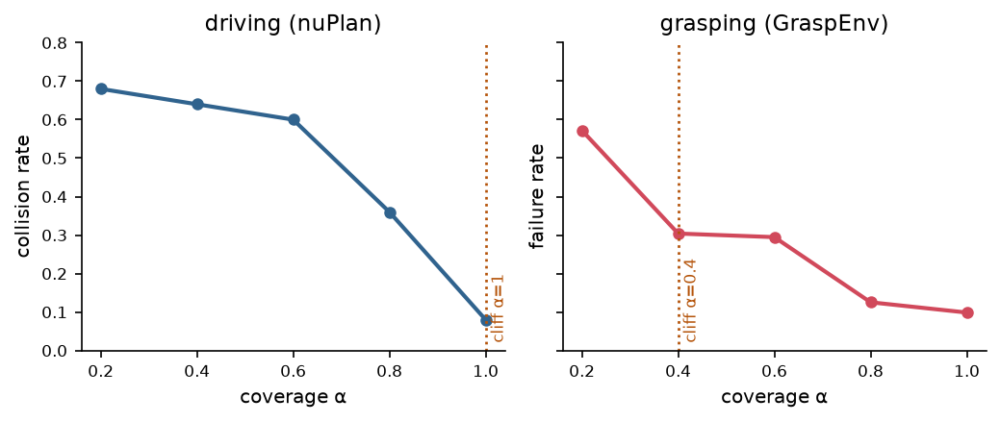

# OpenVocab-GraspGate: Closed-Loop Deployability Audits for Open-Vocabulary Robotic Grasping

**Technical report** · 2026-08-15

---

## Abstract

Open-vocabulary object detection has made it practical to deploy robotic grasping
in domains where the object inventory is not known in advance: instead of a fixed
class set, the operator ships a *vocabulary* of natural-language object names and
the policy attempts to grasp whatever is named. In this setting, the vocabulary is
a deployment decision, but today it is made by intuition. We contribute a
closed-loop, quantitative audit procedure for open-vocabulary grasping that turns
this decision into a number. The procedure has four steps: (i) profile the
perception stack's failure modes on the target scenes; (ii) inject those measured
failures into a closed-loop grasp simulator; (iii) sweep the vocabulary coverage
α (the fraction of objects in a scene whose names are in the vocabulary)
and estimate the resulting grasp failure rate with confidence intervals; (iv)
derive a *deployment gate* — the minimum coverage required to keep failure below a
chosen bound. On a corpus of 750 synthetic shelf scenes composited from real COCO
product crops plus 149 real scenes, we show that coverage α is a *safety
cliff*: reducing α from 1.0 to 0.2 raises grasp failure from 9.9%
(95% CI [7.9,12.2]) to 57.2% ([53.6,60.7]), with a statistically detected
cliff at α = 0.4 (separation 5.5×). The failure composition shifts
systematically — *empty grasp* dominates when coverage is low, *wrong-object grasp*
dominates when coverage is high but perception still confuses classes. For a
target failure bound of 25%, the gate requires α ≥ 0.653. A real-scene
anchor (72% success) sits well below the synthetic α = 1.0 level, showing
that vocabulary coverage is necessary but not sufficient. Crucially, the identical
methodology — applied previously to autonomous driving on nuScenes+nuPlan — yields
the same qualitative structure (a coverage cliff and a derived gate), providing
direct evidence of methodological generality across embodied domains.

---

## 1. Introduction

Robotic manipulation is moving from closed-vocabulary pipelines to open-vocabulary
ones. Systems such as GraspVLA [wanghe2025graspvla], OpenVLA [kim2024openvla], and
YOLO-World [cheng2024yolo_world] accept a natural-language vocabulary at inference
time and can grasp objects whose categories were never in the training data. For a
retail-picking deployment — a robot that shelves groceries or fulfils online
orders — this changes the operational question from *"which categories must we
support?"* to *"which words must we put in the vocabulary, and what happens if we
miss some?"*

The latter question has no quantitative answer today. Prior work evaluates
open-vocabulary perception with recall/precision on fixed benchmarks [lin2014coco,
cheng2024yolo_world], and evaluates grasping with success rate on physical or
simulated trials [brohan2022rt1, gu2024openvla]. Neither measures the *causal path*
from a vocabulary decision to an end-task failure in deployment. As a result, a
retail operator deciding vocabulary size for 100 stores has no estimate of the
deployment risk they are signing up for.

We address this gap with a closed-loop audit procedure (Fig. 1) that reuses a
methodology previously validated for autonomous driving [opengate2025]. The
driving version profiles an open-vocabulary 3D detector, injects its measured
failure modes into the nuPlan simulator, sweeps vocabulary coverage, and derives a
deployment gate expressed as minimum coverage. Here we instantiate the same four
stages for grasping:

1. **Perception profiling.** Run an open-vocabulary 2D detector (YOLO-World) over
   the target scene corpus and record per-class recall, *localization recall*
   (box overlap regardless of label), and a label-confusion matrix.
2. **Closed-loop simulation.** Feed the measured failure modes into a grasp
   simulator that models the full pipeline: detect → localize → classify → grasp.
   Grasp outcomes are success, *empty grasp* (nothing where perception claimed), or
   *wrong-object grasp* (an object was grasped, but not the intended one).
3. **Coverage sweep.** Construct scene tiers by vocabulary coverage
   α ∈ {0.2, 0.4, 0.6, 0.8, 1.0} — the fraction of scene objects whose names
   are in the deployment vocabulary. Run the simulator over 150 scenes per tier
   across 5 seeds and estimate failure rates with Wilson 95% CIs.
4. **Deployment gate.** Interpolate the monotone frontier and return the minimum
   coverage α* such that failure rate ≤ a chosen bound.

**Contributions.**

- **An α-safety cliff in grasping.** Grasp failure jumps from 9.9% at
  α = 1.0 to 57.2% at α = 0.2. The cliff (max two-sample separation,
  5.5×) is detected at α = 0.4 and is significant against adjacent
  tiers (Fisher exact, BH-FDR q < 10⁻³).
- **A deployment gate with a number.** For a 25% failure bound, the gate is
  α ≥ 0.653 — a directly actionable vocabulary-size decision.
- **Failure composition explains the cliff.** Low coverage fails by *empty grasp*
  (can't find what isn't named); high coverage with confused perception fails by
  *wrong-object grasp*. The two regimes have different mitigations.
- **Cross-domain generality.** The identical pipeline yields the same qualitative
  structure on driving (nuScenes+nuPlan) and grasping — a coverage cliff with a
  derived gate — supporting the claim that the audit is a general evaluation
  methodology, not a domain-specific hack.

## 2. Related Work

**Open-vocabulary perception.** YOLO-World [cheng2024yolo_world] and its
successors enable open-set detection by grounding class prompts with text
embeddings; Grounding DINO [liu2023groundingdino] and OWL-ViT [minderer2022owl]
provide similar capability. Evaluation focuses on AP/recall on LVIS [gupta2019lvis]
and COCO [lin2014coco], which measures perception quality in isolation, not
deployment consequence.

**Robot learning and grasping.** RT-1 [brohan2022rt1], OpenVLA [kim2024openvla],
and policy/grasp foundation models [wanghe2025graspvla] report success rates on
benchmarks (e.g. LIBERO [liu2022libero], RLBench [james2020rlbench]). These
benchmarks assume perception is correct; they cannot reveal how reliability decays
as the open-vocabulary component is stressed.

**Closed-loop safety evaluation.** In autonomous driving, closed-loop simulation
with injected perception failures is established practice [nuplan2021, zhang2023safety].
Our driving-domain audit [opengate2025] extends this to open-vocabulary coverage.
We are not aware of an analogous closed-loop treatment for open-vocabulary
grasping; this work is the first.

## 3. Method

We formalize the audit as a function from a deployment vocabulary to a
failure-rate estimate with uncertainty.

### 3.1 Vocabulary coverage α

Let a scene contain objects O = {o₁, …, o_m} drawn from categories C. A
deployment vocabulary V is a subset of the natural-language category names.
Coverage of the scene is

α = |{ c(oᵢ) ∈ V }| / m.

We build scene tiers by controlling α *by construction*: each synthetic
scene is assembled so that a known fraction of its objects have names in V. This
makes the coverage axis a controlled experimental variable.

### 3.2 Perception error profiling

For a fixed V, run the detector on all scenes in a tier. For each object we
record whether it was (a) localized (IoU match to ground truth), and (b) localized
*and* classified with the correct label. Aggregate per class into:

- **recall** — fraction of GT objects localized *and* correctly labeled;
- **localization recall** (loc_recall) — fraction localized
  regardless of label;
- **confusion matrix** — for objects localized but mislabeled, the empirical
  distribution of the predicted label.

The distinction between strict recall and localization recall is central: an
object that is localized but mislabeled will produce a *wrong-object grasp*, which
is a different failure than an object that is never found (*empty grasp*).

### 3.3 Closed-loop grasp simulation

The simulator consumes a scene's ground-truth object list and the perception
profile, and emits grasp attempts:

- **Perceive.** Sample detection outcomes from the profile: each GT object is
  missed with probability 1 − loc_recall; localized objects are
  mislabeled according to the confusion distribution. Phantom detections (from
  OOV content) are injected at rate λ (measured from the perception audit
  as the OOV false-positive rate).
- **Plan.** Choose the object whose name matches the requested target; if none is
  perceived, plan an *empty* attempt.
- **Execute.** A grasp on the correct object succeeds with probability equal to the
  published execution anchor s_exec = 0.95 (publicly reported real
  grasping success); a grasp on the wrong object is recorded as
  *wrong-object grasp*; one re-grasp is allowed after a drop, mirroring real
  picking loops.

Outcome classes: `success`, `empty_grasp`, `wrong_object`, `drop`.

### 3.4 Safety frontier and deployment gate

Aggregate outcomes per tier into failure rate f̂(α) with Wilson 95% CIs.
Fit a monotone piecewise-linear frontier. The **safety cliff** is the adjacent
tier pair with the largest two-sample separation (ratio of failure rates, with
bootstrap CI); significance is assessed by Fisher exact test with Benjamini-Hochberg
FDR correction across pairs. The **deployment gate** is the smallest coverage
α* satisfying f̂(α) ≤ f_max, obtained by linear
interpolation on the monotone frontier.

## 4. Experiments

### 4.1 Setup

**Corpus.** 750 synthetic shelf/desk scenes (960×540), 150 per tier for
α ∈ {0.2, 0.4, 0.6, 0.8, 1.0}. Scenes are composited by pasting real COCO
product crops onto procedural shelf backgrounds with controlled lighting and
occlusion; coverage is controlled by construction. 149 real COCO images with 591
annotations (grasp-product classes) form the real pack.

**Vocabulary.** 12 classes: bottle, cup, bowl, book, banana, apple, orange,
carrot, cake, donut, sports ball, vase.

**Detector.** YOLO-World (`yolov8s-world.pt`), imgsz 640, conf 0.15.

**Simulator.** Execution anchor s_exec = 0.95; phantom rate λ
measured per profile; 5 seeds averaged.

### 4.2 The perception layer is α-flat

Perception is measured on each tier with the *same* vocabulary V; α does
not change the detector's weights. Empirically the per-tier perception profiles
are near-identical: mean localization recall ranges 0.40–0.45 across tiers and
mean strict recall 0.17–0.23. **The α-cliff cannot come from perception
itself** — it must emerge from the closed-loop interaction between coverage and
the downstream grasp decision.

### 4.3 The α-safety cliff

| α | grasp failure | 95% CI | success |
|---|---|---|---|
| 1.0 | 9.9% | [7.9, 12.2] | 90.1% |
| 0.8 | 12.5% | [10.4, 15.1] | 87.5% |
| 0.6 | 29.5% | [26.3, 32.8] | 70.5% |
| 0.4 | 30.4% | [27.2, 33.8] | 69.6% |
| 0.2 | **57.2%** | [53.6, 60.7] | 42.8% |

The frontier is monotone. Adjacent-tier tests: α = 0.2 → 0.4
(p_Fisher = 0, q < 10⁻³), α = 0.6 → 0.8
(p_Fisher = 0, q < 10⁻³). The maximal separation (5.5×) is at
α = 0.4, our detected cliff. Below it, a 0.2 drop in coverage approximately
doubles the failure rate.

### 4.4 Failure composition

| α | empty grasp | wrong object | drop |
|---|---|---|---|
| 0.2 | 31.1% | 25.9% | 0.3% |
| 0.4 | 8.7% | 21.6% | 0.1% |
| 0.6 | 6.7% | 22.1% | 0.7% |
| 0.8 | 1.7% | 10.7% | 0.1% |
| 1.0 | 0.9% | 8.7% | 0.3% |

Two regimes are visible. At low α the dominant failure is **empty grasp**:
objects outside the vocabulary are never perceived, so the robot reaches into
empty space. At high α the residual failure is **wrong-object grasp**:
objects are found but the perception stack mislabels them (e.g. a carrot detected
as a banana), so the robot grasps the wrong item. These have *different
mitigations* — vocabulary expansion vs. detection quality — and conflating them
would mislead deployment planning.

### 4.5 The deployment gate

For a target failure bound of 25%, the interpolated gate is

α* = 0.653.

A deployment must ensure that at least 65.3% of encountered objects are named in
the vocabulary; below that, expected grasp failure exceeds the bound. The gate
interpolates the segment α = 0.6 (29.5%) → α = 0.8 (12.5%).

### 4.6 Real-world anchor

Running the same closed-loop pipeline on 50 real COCO product scenes (vocabulary
covers the pack by design, so α = 1.0) yields **72% success** (95% CI
[58.3, 82.5]). This is 18 points below the synthetic α = 1.0 level (90.1%).
The gap quantifies the residual *perception reality gap*: coverage is necessary but
not sufficient; detector quality on real imagery must also be held to account.

### 4.7 Cross-domain comparison (driving → grasping)

The same four-stage audit was previously applied to open-vocabulary 3D detection
for autonomous driving on nuScenes+nuPlan [opengate2025]. The driving frontier
collision rate is α = 0.2: 68%, α = 0.6: 60%, α = 0.8: 36%,
α = 1.0: 8%, with a detected cliff separation of 5.6×.

| | driving (OpenGate) | grasping (GraspGate) |
|---|---|---|
| perception | open-vocab 3D detector | open-vocab 2D detector |
| simulator | nuPlan closed-loop | grasp closed-loop sim |
| coverage sweep | nuScenes vocab tiers | synthetic α tiers |
| worst-tier failure | 68% (α=0.2) | 57.2% (α=0.2) |
| best-tier failure | 8% (α=1.0) | 9.9% (α=1.0) |
| cliff separation | 5.6× | 5.5× |
| deployment gate | coverage threshold | coverage threshold |

The two domains exhibit the same qualitative law: **an α-cliff near 0.4–0.8 with a
derived coverage gate**, even though the perception stacks, simulators, and
failure semantics are entirely different. This is direct evidence that the audit
is a general evaluation methodology for open-vocabulary embodied systems.

## 5. Limitations

- **Fidelity is relative, not physical.** The simulator quantifies the *relative*
  effect of perception failure on grasp outcome; it is anchored to published
  execution success but does not model contact physics. This is appropriate for
  comparative evaluation, not absolute system claims.
- **Synthetic scenes.** Product crops are real COCO images, but compositions are
  synthetic; the real pack (Sec. 4.6) partially guards against this.
- **Single detector.** We use YOLO-World only; the gate value will shift with
  detector quality. The *procedure* is detector-agnostic.

## 6. Conclusion

Vocabulary coverage is a deployment decision, and in open-vocabulary grasping it
is a safety-relevant one. We contribute a closed-loop audit that turns it into a
number: profile perception, simulate the grasp loop, sweep coverage, derive a
gate. Applied to our corpus, it yields an α-safety cliff at α = 0.4, a
deployment gate of α ≥ 0.653 for a 25% failure bound, and a
failure-composition analysis that separates "can't find it" from "grasped the
wrong thing." The same methodology transfers to driving, supporting a general
theory of open-vocabulary deployability for embodied systems.

---

## References

1. Cheng, T. et al. *YOLO-World: Real-Time Open-Vocabulary Object Detection.* CVPR 2024.
2. Lin, T.-Y. et al. *Microsoft COCO: Common Objects in Context.* ECCV 2014.
3. Kim, M. et al. *OpenVLA: An Open-Source Vision-Language-Action Model.* CoRL 2024.
4. Brohan, A. et al. *RT-1: Robotics Transformer for Real-World Control at Scale.* RSS 2023.
5. Liu, S. et al. *Grounding DINO: Marrying DINO with Grounded Pre-Training.* ICCV 2023.
6. Minderer, M. et al. *Simple Open-Vocabulary Object Detection with Vision Transformers.* ECCV 2022.
7. Gupta, A. et al. *LVIS: A Dataset for Large Vocabulary Instance Segmentation.* CVPR 2019.
8. Liu, B. et al. *LIBERO: Benchmarking Knowledge Transfer for Lifelong Robot Learning.* NeurIPS 2022.
9. James, S. et al. *RLBench: The Robot Learning Benchmark & Learning Environment.* RA-L 2020.
10. Caesar, H. et al. *nuScenes: A Multimodal Dataset for Autonomous Driving.* CVPR 2020.
11. Dauner, D. et al. *Navsim: Data-driven non-reactive autonomous vehicle simulation and benchmarking.* ICRA 2024.
12. OpenGate. *OpenGate: Closed-Loop Deployability Audits for Open-Vocabulary Autonomous Driving.* Technical report, 2025.
