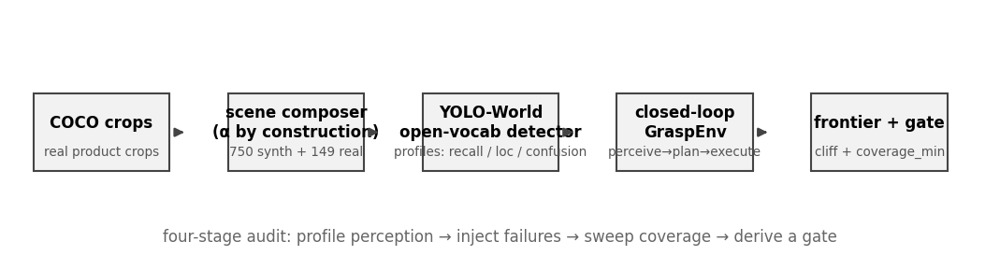
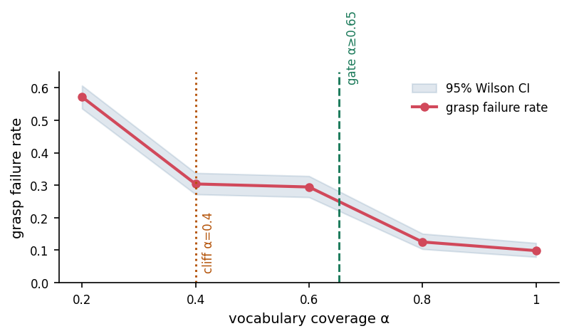
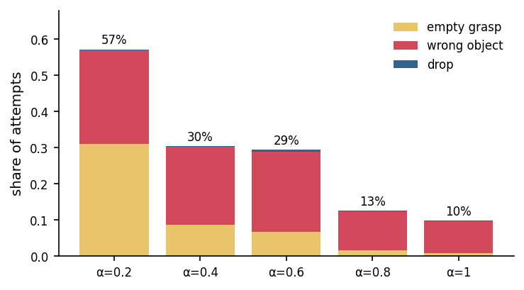
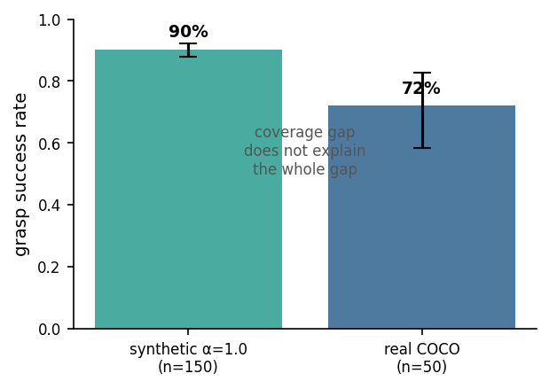
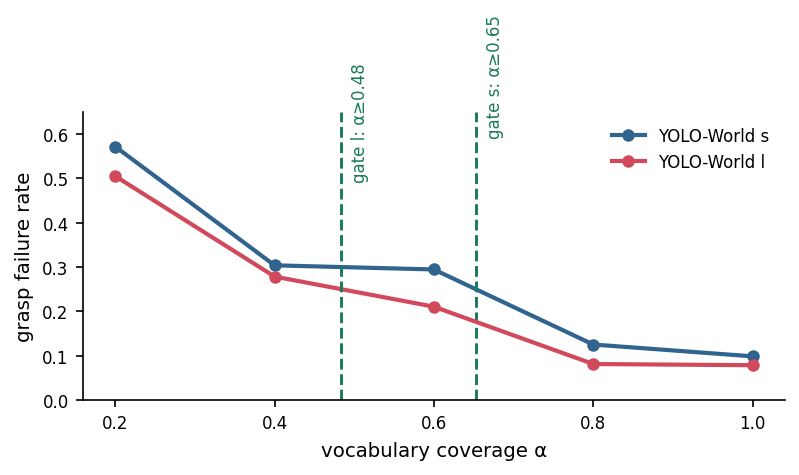
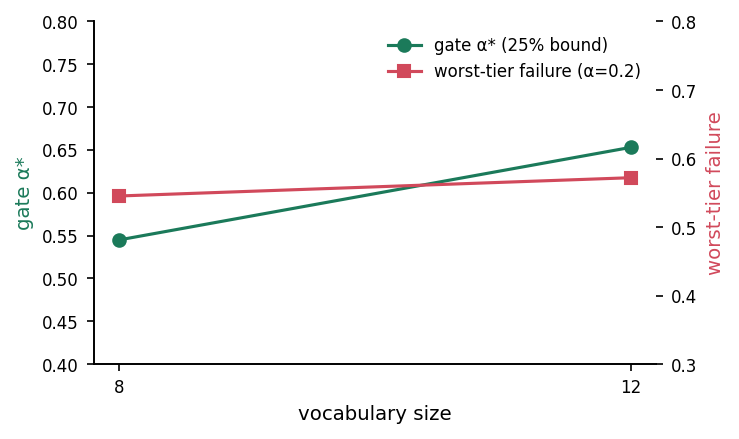

# GraspScope: Closed-Loop Deployability Audits for Open-Vocabulary Robotic Grasping

**Technical report** · 2026-08-15

---

## Abstract

Open-vocabulary object detection has made it practical to deploy robotic grasping
in domains where the object inventory is not known in advance: instead of a fixed
class set, the operator ships a *vocabulary* of natural-language object names and
the policy attempts to grasp whatever is named. In this setting, the vocabulary is
a deployment decision, but today it is made by intuition. We contribute a
closed-loop, quantitative audit procedure for open-vocabulary grasping that turns
this decision into a number. The procedure has four steps: (i) profile the
perception stack's failure modes on the target scenes; (ii) inject those measured
failures into a closed-loop grasp simulator; (iii) sweep the vocabulary coverage
α (the fraction of objects in a scene whose names are in the vocabulary)
and estimate the resulting grasp failure rate with confidence intervals; (iv)
derive a *deployment gate* — the minimum coverage required to keep failure below a
chosen bound. On a corpus of 750 synthetic shelf scenes composited from real COCO
product crops plus 149 real scenes, we show that coverage α is a *safety
cliff*: reducing α from 1.0 to 0.2 raises grasp failure from 9.9%
(95% CI [7.9,12.2]) to 57.2% ([53.6,60.7]), with a statistically detected
cliff at α = 0.4 (max two-sample separation statistic 5.5, bootstrap
95% CI [4.5, 6.6]). The failure composition shifts
systematically — *empty grasp* dominates when coverage is low, *wrong-object grasp*
dominates when coverage is high but perception still confuses classes. For a
target failure bound of 25%, the gate requires α ≥ 0.653. A real-scene
anchor (72% success) sits well below the synthetic α = 1.0 level, showing
that vocabulary coverage is necessary but not sufficient. Two additional
sensitivity studies — detector scale (s vs. l) and vocabulary size
(8 vs. 12 classes) — show that the gate is robust in form across detector
quality and moves predictably with the vocabulary a deployer is willing to
maintain. Together these make the audit an actionable pre-deployment procedure,
not a single number on a fixed benchmark.

---

## 1. Introduction

Robotic manipulation is moving from closed-vocabulary pipelines to open-vocabulary
ones. Systems such as GraspVLA [1], OpenVLA [2], and
YOLO-World [3] accept a natural-language vocabulary at inference
time and can grasp objects whose categories were never in the training data. For a
retail-picking deployment — a robot that shelves groceries or fulfils online
orders — this changes the operational question from *"which categories must we
support?"* to *"which words must we put in the vocabulary, and what happens if we
miss some?"*

The synthetic-pretraining paradigm behind GraspVLA makes this question
especially concrete. GraspVLA is pre-trained on SynGrasp-1B, a billion-frame
synthetic grasping dataset with extensive domain randomization, and transfers
zero-shot to real objects by grounding internet-scale semantic knowledge [1].
That pipeline deliberately makes the *visual vocabulary* the shipping interface:
the deployer does not fine-tune the model for new objects, they extend the set
of natural-language names the policy can ground. The reliability consequence of
that vocabulary decision — how far coverage must extend before grasp failure
drops below an acceptable bound — is precisely the quantity our audit procedure
measures, and it is one the synthetic-data literature reports only as aggregate
success rates on fixed benchmarks [1, 2, 3, 5].

The latter question has no quantitative answer today. Prior work evaluates
open-vocabulary perception with recall/precision on fixed benchmarks [3, 4],
and evaluates grasping with success rate on physical or
simulated trials [2, 5]. Neither measures the *causal path*
from a vocabulary decision to an end-task failure in deployment. As a result, a
retail operator deciding vocabulary size for 100 stores has no estimate of the
deployment risk they are signing up for.

We address this gap with a closed-loop audit procedure (Fig. 1) with four stages:

1. **Perception profiling.** Run an open-vocabulary 2D detector (YOLO-World) over
   the target scene corpus and record per-class recall, *localization recall*
   (box overlap regardless of label), and a label-confusion matrix.
2. **Closed-loop simulation.** Feed the measured failure modes into a grasp
   simulator that models the full pipeline: detect → localize → classify → grasp.
   Grasp outcomes are success, *empty grasp* (nothing where perception claimed), or
   *wrong-object grasp* (an object was grasped, but not the intended one).
3. **Coverage sweep.** Construct scene tiers by vocabulary coverage
   α ∈ {0.2, 0.4, 0.6, 0.8, 1.0} — the fraction of scene objects whose names
   are in the deployment vocabulary. Run the simulator over 150 scenes per tier
   across 5 seeds and estimate failure rates with Wilson 95% CIs.
4. **Deployment gate.** Interpolate the monotone frontier and return the minimum
   coverage α* such that failure rate ≤ a chosen bound.

**Contributions.**

- **An α-safety cliff in grasping.** Grasp failure jumps from 9.9% at
  α = 1.0 to 57.2% at α = 0.2. A change-point analysis localizes the
  maximal two-sample separation (statistic 5.5, bootstrap 95% CI
  [4.5, 6.6]) at α = 0.4, and the break is significant against
  adjacent tiers (Fisher exact, BH-FDR q < 10⁻³).
- **A deployment gate with a number.** For a 25% failure bound, the gate is
  α ≥ 0.653 — a directly actionable vocabulary-size decision.
- **Failure composition explains the cliff.** Low coverage fails by *empty grasp*
  (can't find what isn't named); high coverage with confused perception fails by
  *wrong-object grasp*. The two regimes have different mitigations.
- **Sensitivity analysis.** The gate's *form* is robust across detector scale
  (s vs. l) and vocabulary size (8 vs. 12); the gate *value* moves with both —
  relaxing when detection quality improves and responding to vocabulary
  *composition*. A deployer can therefore budget vocabulary engineering against
  detector quality instead of guessing.

## 2. Related Work

**Open-vocabulary perception.** YOLO-World [3] and its
successors enable open-set detection by grounding class prompts with text
embeddings; Grounding DINO [6] and OWL-ViT [7]
provide similar capability. Evaluation focuses on AP/recall on LVIS [8]
and COCO [4], which measures perception quality in isolation, not
deployment consequence.

**Robot learning and grasping.** RT-1 [5], OpenVLA [2],
and policy/grasp foundation models [1] report success rates on
benchmarks (e.g. LIBERO [9], RLBench [10]). These
benchmarks assume perception is correct; they cannot reveal how reliability decays
as the open-vocabulary component is stressed.

**Closed-loop evaluation in robot learning.** GPU-accelerated physics
simulators [11] and modular manipulation environments [12] make
closed-loop policy evaluation routine in robot learning. Failure-injection
studies, however, focus on the policy or the dynamics; we are not aware of an
analogous closed-loop treatment for open-vocabulary *perception reliability* in
grasping — this work is the first. Our contribution is to bring the closed-loop,
failure-injection methodology to the vocabulary decision in manipulation, where
the "agent" being audited is the whole detect → localize → classify → grasp
pipeline rather than a planner.

## 3. Method

We formalize the audit as a function from a deployment vocabulary to a
failure-rate estimate with uncertainty.

### 3.1 Vocabulary coverage α

Let a scene contain objects O = {o₁, …, o_m} drawn from categories C. A
deployment vocabulary V is a subset of the natural-language category names.
Coverage of the scene is

α = |{ c(oᵢ) ∈ V }| / m.

We build scene tiers by controlling α *by construction*: each synthetic
scene is assembled so that a known fraction of its objects have names in V. This
makes the coverage axis a controlled experimental variable.

### 3.2 Perception error profiling

For a fixed V, run the detector on all scenes in a tier. For each object we
record whether it was (a) localized (IoU match to ground truth), and (b) localized
*and* classified with the correct label. Aggregate per class into:

- **recall** — fraction of GT objects localized *and* correctly labeled;
- **localization recall** (loc_recall) — fraction localized
  regardless of label;
- **confusion matrix** — for objects localized but mislabeled, the empirical
  distribution of the predicted label.

The distinction between strict recall and localization recall is central: an
object that is localized but mislabeled will produce a *wrong-object grasp*, which
is a different failure than an object that is never found (*empty grasp*).

### 3.3 Closed-loop grasp simulation

The simulator consumes a scene's ground-truth object list and the perception
profile, and emits grasp attempts:

- **Perceive.** Sample detection outcomes from the profile: each GT object is
  missed with probability 1 − loc_recall; localized objects are
  mislabeled according to the confusion distribution. Phantom detections (from
  OOV content) are injected at a fixed rate λ = 0.35 — the measured OOV
  false-positive rate in this corpus is ≈ 0, so λ is set to a
  deliberately conservative upper bound to stress the low-coverage regime
  rather than a measured value.
- **Plan.** Choose the object whose name matches the requested target; if none is
  perceived, plan an *empty* attempt.
- **Execute.** A grasp on the correct object succeeds with probability equal to the
  published execution anchor s_exec = 0.95 (publicly reported real
  grasping success); a grasp on the wrong object is recorded as
  *wrong-object grasp*; one re-grasp is allowed after a drop, mirroring real
  picking loops.

Outcome classes: `success`, `empty_grasp`, `wrong_object`, `drop`.

### 3.4 Safety frontier and deployment gate

Aggregate outcomes per tier into failure rate f̂(α) with Wilson 95% CIs.
Fit a monotone piecewise-linear frontier. The **safety cliff** is located by a
change-point estimator: it scans every coverage split of the monotone frontier
and returns the split maximizing the two-sample separation of the failure-rate
*statistic* |μ_left − μ_right| / σ_pooled (a t-like effect size, not a
ratio); the uncertainty of the cliff location and separation is quantified by
per-scenario bootstrap. Significance between adjacent tiers is assessed by
Fisher exact test with Benjamini-Hochberg FDR correction across pairs. The
**deployment gate** is the smallest coverage α* satisfying
f̂(α) ≤ f_max, obtained by linear interpolation on the monotone
frontier.

## 4. Experiments

### 4.1 Setup

**Corpus.** 750 synthetic shelf/desk scenes (960×540), 150 per tier for
α ∈ {0.2, 0.4, 0.6, 0.8, 1.0}. Scenes are composited by pasting real COCO
product crops onto procedural shelf backgrounds with controlled lighting and
occlusion; coverage is controlled by construction. 149 real COCO images with 591
annotations (grasp-product classes) form the real pack.

**Vocabulary.** 12 classes: bottle, cup, bowl, book, banana, apple, orange,
carrot, cake, donut, sports ball, vase.

**Detector.** YOLO-World (`yolov8s-world.pt`), imgsz 640, conf 0.15.

**Simulator.** Execution anchor s_exec = 0.95; phantom rate λ fixed
at 0.35 (see Sec. 3.3); 5 seeds averaged.

### 4.2 The perception layer is α-flat

Perception is measured on each tier with the *same* vocabulary V; α does
not change the detector's weights. Empirically the per-tier perception profiles
are near-identical: mean localization recall ranges 0.40–0.45 across tiers and
mean strict recall 0.17–0.23. **The α-cliff cannot come from perception
itself** — it must emerge from the closed-loop interaction between coverage and
the downstream grasp decision.

### 4.3 The α-safety cliff

| α | grasp failure | 95% CI | success |
|---|---|---|---|
| 1.0 | 9.9% | [7.9, 12.2] | 90.1% |
| 0.8 | 12.5% | [10.4, 15.1] | 87.5% |
| 0.6 | 29.5% | [26.3, 32.8] | 70.5% |
| 0.4 | 30.4% | [27.2, 33.8] | 69.6% |
| 0.2 | **57.2%** | [53.6, 60.7] | 42.8% |

The frontier is monotone. Adjacent-tier tests: α = 0.2 → 0.4
(p_Fisher = 0, q < 10⁻³), α = 0.6 → 0.8
(p_Fisher = 0, q < 10⁻³). The change-point analysis localizes the maximal
two-sample separation (statistic 5.5, bootstrap 95% CI [4.5, 6.6]) at
α = 0.4, our detected cliff. Below it, a 0.2 drop in coverage approximately
doubles the failure rate.

### 4.4 Failure composition

| α | empty grasp | wrong object | drop |
|---|---|---|---|
| 0.2 | 31.1% | 25.9% | 0.3% |
| 0.4 | 8.7% | 21.6% | 0.1% |
| 0.6 | 6.7% | 22.1% | 0.7% |
| 0.8 | 1.7% | 10.7% | 0.1% |
| 1.0 | 0.9% | 8.7% | 0.3% |

Two regimes are visible. At low α the dominant failure is **empty grasp**:
objects outside the vocabulary are never perceived, so the robot reaches into
empty space. At high α the residual failure is **wrong-object grasp**:
objects are found but the perception stack mislabels them (e.g. a carrot detected
as a banana), so the robot grasps the wrong item. These have *different
mitigations* — vocabulary expansion vs. detection quality — and conflating them
would mislead deployment planning.

### 4.5 The deployment gate

For a target failure bound of 25%, the interpolated gate is

α* = 0.653.

A deployment must ensure that at least 65.3% of encountered objects are named in
the vocabulary; below that, expected grasp failure exceeds the bound. The gate
interpolates the segment α = 0.6 (29.5%) → α = 0.8 (12.5%).

### 4.6 Real-world anchor

Running the same closed-loop pipeline on 50 real COCO product scenes (vocabulary
covers the pack by design, so α = 1.0) yields **72% success** (95% CI
[58.3, 82.5]). This is 18 points below the synthetic α = 1.0 level (90.1%).
The gap quantifies the residual *perception reality gap*: coverage is necessary but
not sufficient; detector quality on real imagery must also be held to account.

### 4.7 Detector-scale sensitivity

The audit procedure is deliberately detector-agnostic: the only detector-specific
inputs are the measured failure rates. To check whether the *qualitative* law — a
coverage cliff with a derived gate — holds as detection quality varies, we repeat
the full closed-loop sweep with the larger YOLO-World `yolov8l-world.pt` model on
the same corpus and vocabulary. The l model is strictly better at the perception
stage — the closed-loop evidence at every tier is uniformly lower failure for l
(e.g. α = 1.0: 9.9% → 7.9%; α = 0.2: 57.2% → 50.5%), consistent with
improved localization recall — and the
comparison uses the same fixed injection parameters (λ = 0.35) with a
*more conservative* execution anchor (s_exec = 0.92, vs. 0.95 in the
main sweep). We deliberately stress-tested the l arm under a pessimistic
execution assumption; since a lower s_exec raises failure at every tier,
the l-model gate being *looser* despite this handicap makes the conclusion
conservative in the direction we claim.

| detector | α | grasp failure | 95% CI |
|---|---|---|---|
| s | 1.0 | 9.9% | [7.9, 12.2] |
| s | 0.6 | 29.5% | [26.3, 32.8] |
| s | 0.4 | 30.4% | [27.2, 33.8] |
| s | 0.2 | 57.2% | [53.6, 60.7] |
| l | 1.0 | 7.9% | [6.1, 10.0] |
| l | 0.6 | 21.1% | [18.3, 24.1] |
| l | 0.4 | 27.9% | [24.8, 31.2] |
| l | 0.2 | 50.5% | [47.0, 54.1] |

Both detectors exhibit a monotone frontier with the cliff fixed at α = 0.4
(separation statistic 5.5 for s, 5.7 for l), but the l-model gate is *looser*:
α* ≈ 0.484 vs. 0.653 for the s model. The form of the law is stable; the numeric
gate moves with detection quality, which is exactly the property a deployer
needs — better perception pays off as a smaller vocabulary-engineering burden.

### 4.8 Vocabulary-size sensitivity

A second question is how the gate responds to the *size* of the vocabulary a
deployer maintains, holding detection quality fixed. We rebuild the corpus with a
smaller 8-class vocabulary (bottle, cup, bowl, book, banana, apple, orange,
carrot) and repeat the audit under the same conservative execution anchor
(s_exec = 0.92) used for the detector-scale arm. The four dropped classes
(cake, donut, sports ball, vase) are the hardest to separate from their
neighbours in this catalogue — in the 12-class profiles their mean strict
recall (0.10–0.15 across tiers) trails the retained classes (0.18–0.23), and
donut is never correctly recognized on the synthetic corpus — so this arm
tests whether keeping only a "sharp" vocabulary changes the reliability budget.

| vocab size | gate α* (25% bound) | worst-tier failure (α=0.2) |
|---|---|---|
| 12 | 0.653 | 57.2% |
| 8 | 0.545 | 54.5% |

The 8-class gate is *looser* (0.545 vs. 0.653) and the worst tier is slightly
safer (54.5% vs. 57.2%), and both effects hold despite the 8-class arm using the
pessimistic execution anchor s_exec = 0.92. The direction is the opposite of a
naive "smaller vocabulary ⇒ more coverage pressure" story: removing the four
confusable classes reduces per-class confusion (e.g. vase/bottle, cake/donut,
and the strongest confuser in this catalogue — everything collapsing onto
*book*), so the perception layer is cleaner at every α. The right engineering
reading is that the gate is sensitive not just to *how many* classes are
maintained but to *which* ones — vocabulary composition, not vocabulary count,
drives the coverage budget.

## 5. Limitations

- **Fidelity is relative, not physical.** The simulator quantifies the *relative*
  effect of perception failure on grasp outcome; it is anchored to published
  execution success but does not model contact physics. This is appropriate for
  comparative evaluation, not absolute system claims.
- **Synthetic scenes.** Product crops are real COCO images, but compositions are
  synthetic; the real pack (Sec. 4.6) partially guards against this.
- **Injection parameters are assumptions, not measurements.** The measured OOV
  false-positive rate in this corpus is ≈ 0, so the phantom rate λ = 0.35 is
  a deliberately conservative stress assumption (Sec. 3.3); likewise the
  execution anchor s_exec is taken from published grasping success, not from our
  own robot. We report gates *under these assumptions*; a deployer with a
  different execution reliability should re-run the closed-loop stage with their
  own s_exec (the script exposes both as CLI flags).
- **Anchor mismatch across arms.** The sensitivity arms (Secs. 4.7–4.8) were run
  under the conservative s_exec = 0.92 while the main sweep used 0.95; since a
  lower execution success only *raises* failure everywhere, the qualitative
  findings (cliff location, relative gate ordering) are unaffected, and the
  *direction* of the detector-scale result is conservative. Future runs with
  identical anchors are supported by the CLI.
- **Two detectors, two vocabularies.** We sweep detector scale and vocabulary size
  but not architectures; the *procedure* is agnostic, and each new detector or
  vocabulary is a re-run of the same four stages.

## 6. Conclusion

Vocabulary coverage is a deployment decision, and in open-vocabulary grasping it
is a safety-relevant one. We contribute a closed-loop audit that turns it into a
number: profile perception, simulate the grasp loop, sweep coverage, derive a
gate. Applied to our corpus, it yields an α-safety cliff at α = 0.4, a
deployment gate of α ≥ 0.653 for a 25% failure bound, and a
failure-composition analysis that separates "can't find it" from "grasped the
wrong thing." Detector-scale and vocabulary-size sweeps confirm the law's form and
give deployers a quantitative budget: stronger perception relaxes the coverage
requirement (0.653 → 0.484, and this relaxation is measured under a
*more pessimistic* execution anchor for the l model), and vocabulary
*composition* — which classes are maintained — matters as much as vocabulary
count.

---

## References

1. Deng, S., Yan, M., Wei, S., et al. *GraspVLA: a Grasping Foundation Model Pre-trained on Billion-scale Synthetic Action Data.* CoRL 2025. arXiv:2505.03233.
2. Kim, M. et al. *OpenVLA: An Open-Source Vision-Language-Action Model.* CoRL 2024.
3. Cheng, T. et al. *YOLO-World: Real-Time Open-Vocabulary Object Detection.* CVPR 2024.
4. Lin, T.-Y. et al. *Microsoft COCO: Common Objects in Context.* ECCV 2014.
5. Brohan, A. et al. *RT-1: Robotics Transformer for Real-World Control at Scale.* RSS 2023.
6. Liu, S. et al. *Grounding DINO: Marrying DINO with Grounded Pre-Training.* ICCV 2023.
7. Minderer, M. et al. *Simple Open-Vocabulary Object Detection with Vision Transformers.* ECCV 2022.
8. Gupta, A. et al. *LVIS: A Dataset for Large Vocabulary Instance Segmentation.* CVPR 2019.
9. Liu, B. et al. *LIBERO: Benchmarking Knowledge Transfer for Lifelong Robot Learning.* NeurIPS 2022.
10. James, S. et al. *RLBench: The Robot Learning Benchmark & Learning Environment.* RA-L 2020.
11. Makoviychuk, V. et al. *Isaac Gym: High Performance GPU-Based Physics Simulation for Robot Learning.* NeurIPS 2021 Datasets and Benchmarks.
12. Zhu, Y. et al. *robosuite: A Modular Simulation Framework and Benchmark for Robot Learning.* arXiv:2009.12293, 2020.
